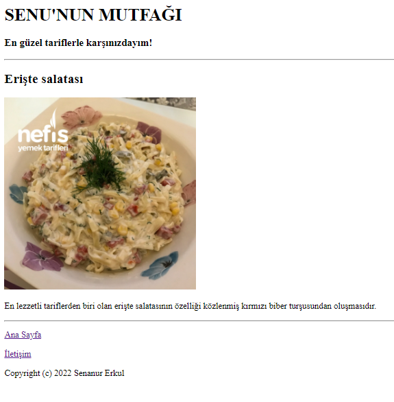
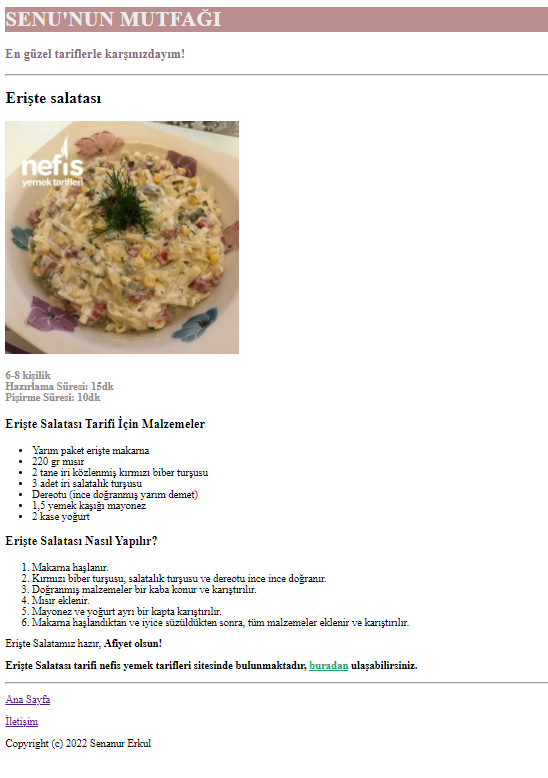
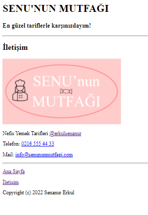

# Kodluyoruz - Ödev - 3 Yemek Tarifim
Bu repo [Kodluyoruz](https://www.kodluyoruz.org/) Front-End Eğitiminde oluşturduğum ödev-3 Yemek tarifi Reposu. İçerisinde bir adet README dosyası, bir adet index.html, bir adet header.html ve img klasörü barındırıyor.

## Installation
Öncelikle projeyi clonelayın.
```
git clone https://github.com/erkulsenanur/kodluyoruzilkrepo.git 
```

## Usage
Projeyi klonladıktan sonra Visual Studio Code programında açınız.

Linux için:
```
cd Kodluyoruz-YemekTarifi
code .
```

## Contributing
Pull requestler kabul edilir. Büyük değişiklikler için, lütfen neyi değiştirmek istediğinizi tartışmak için bir konu açınız.

## License
[MIT](https://choosealicense.com/licenses/mit/)